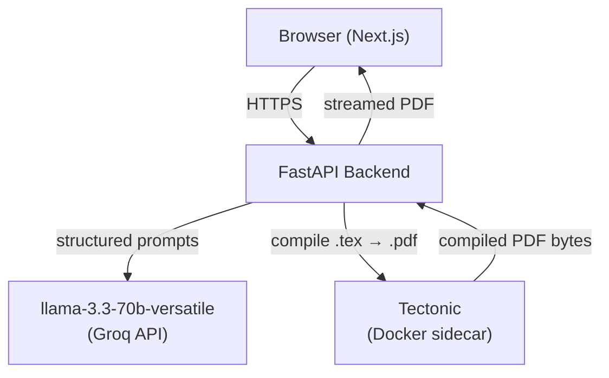
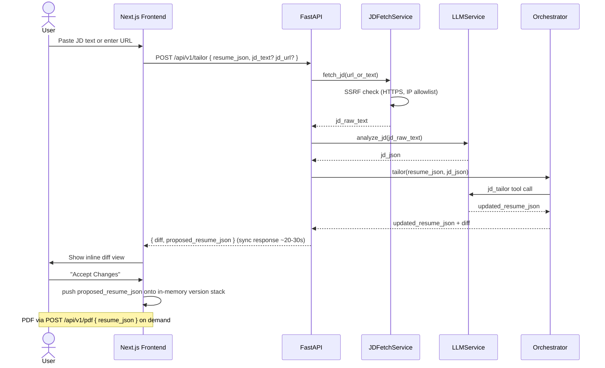
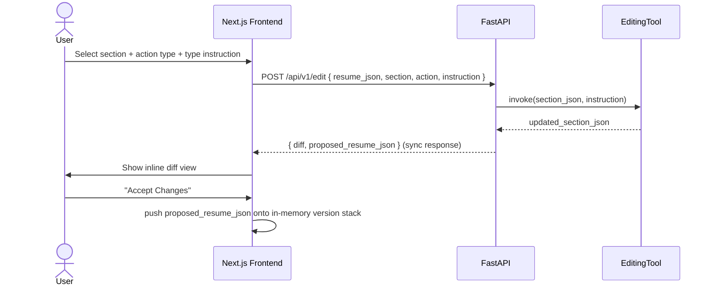
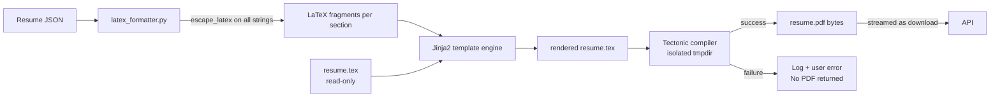
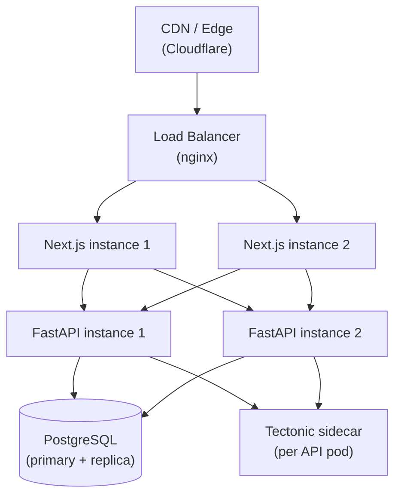
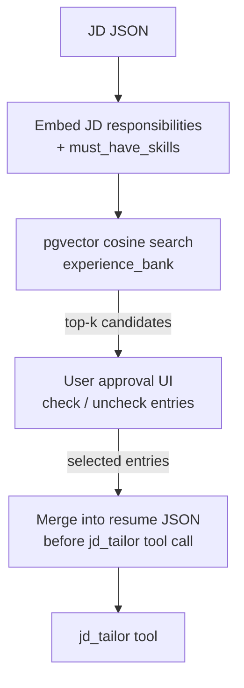

# Architecture: AI-Powered Resume Customization System


> Engineering-level architecture document. Derived from `problemStatement.md` and `context.md`.
> Covers system design, component boundaries, data models, API contracts, and infrastructure.


---


## Table of Contents


1. [System Overview](#1-system-overview)
2. [High-Level Architecture](#2-high-level-architecture)
3. [Codebase Structure](#3-codebase-structure)
4. [Backend Architecture](#4-backend-architecture)
5. [Database Schema](#5-database-schema)
6. [API Design](#6-api-design)
7. [Service Layer](#7-service-layer)
8. [Agent & Orchestrator Design](#8-agent--orchestrator-design)
9. [LaTeX Rendering Pipeline](#9-latex-rendering-pipeline)
10. [Frontend Architecture](#10-frontend-architecture)
11. [Security Architecture](#11-security-architecture)
12. [Infrastructure & Deployment](#12-infrastructure--deployment)
13. [Error Handling Strategy](#13-error-handling-strategy)
14. [Phase 4 — RAG Architecture](#14-phase-4--rag-architecture)


---


## 1. System Overview





> **MVP is fully stateless.** No database. No auth. Resume JSON lives in the browser. The backend is a pure function: JSON in → JSON out (or PDF out).


### Layers at a Glance


| Layer | Responsibility |
|---|---|
| **Frontend** | File upload, section editor, diff viewer, PDF download, in-memory version history |
| **FastAPI** | Routing, service orchestration, synchronous stateless responses |
| **Service layer** | Ingestion, LLM calls, tailoring tools, rendering |
| **Tectonic** | Deterministic LaTeX → PDF compilation (stateless Docker sidecar) |


---


## 2. High-Level Architecture


### 2.1 Request Flow — Resume Upload


```mermaid
sequenceDiagram
    actor User
    participant FE as Next.js Frontend
    participant API as FastAPI
    participant Ingest as IngestionService
    participant LLM as LLMService


    User->>FE: Upload resume file
    FE->>API: POST /api/v1/parse (multipart)
    API->>Ingest: extract(file)
    Ingest->>Ingest: validate size, type, corruption
    Ingest->>Ingest: extract text (pymupdf / python-docx — text-based only; scanned PDFs rejected)
    Ingest-->>API: raw_text
    API->>LLM: parse_resume(raw_text, schema_prompt)
    LLM-->>API: resume_json (up to 3 attempts)
    API->>API: Pydantic validation
    API-->>FE: { resume_json }
    FE->>FE: store resume_json in React state; render editor
```


### 2.2 Request Flow — JD Tailoring





### 2.3 Request Flow — Prompt-Based Edit





---


## 3. Codebase Structure


```
resume-optimiser/
├── backend/
│   ├── app/
│   │   ├── main.py                    # FastAPI app factory, middleware registration
│   │   ├── core/
│   │   │   ├── config.py              # Settings (pydantic-settings, env vars)
│   │   ├── api/
│   │   │   └── v1/
│   │   │       ├── routers/
│   │   │       │   ├── tailor.py      # POST /api/v1/tailor
│   │   │       │   ├── edit.py        # POST /api/v1/edit
│   │   │       │   ├── parse.py       # POST /api/v1/parse — upload → resume_json
│   │   │       │   ├── tailor.py      # POST /api/v1/tailor
│   │   │       │   ├── edit.py        # POST /api/v1/edit
│   │   │       │   └── pdf.py         # POST /api/v1/pdf — resume_json → PDF bytes
│   │   ├── services/
│   │   │   ├── ingestion/
│   │   │   │   ├── pdf_extractor.py   # pymupdf extraction
│   │   │   │   ├── docx_extractor.py  # python-docx extraction (tables included)
│   │   │   │   └── ingestion_service.py  # Orchestrates extraction + validation; returns raw_text
│   │   │   ├── llm/
│   │   │   │   ├── client.py          # Anthropic API wrapper (retry + backoff)
│   │   │   │   ├── resume_parser.py   # Resume extraction prompt + Pydantic validation
│   │   │   │   └── jd_analyzer.py     # JD structured extraction prompt
│   │   │   │   # intent_classifier.py — deferred to post-MVP (explicit params used instead)
│   │   │   ├── tailoring/
│   │   │   │   ├── orchestrator.py    # Routes intent to tool, merges output, computes diff
│   │   │   │   └── tools/
│   │   │   │       ├── jd_tailor.py
│   │   │   │       ├── section_rewriter.py
│   │   │   │       ├── entry_builder.py
│   │   │   │       ├── bullet_editor.py
│   │   │   │       └── entry_remover.py
│   │   │   ├── rendering/
│   │   │   │   ├── latex_formatter.py # resume JSON → LaTeX fragments (with escaping)
│   │   │   │   └── pdf_compiler.py    # Tectonic subprocess, isolated temp dir
│   │   │   ├── storage/
│   │   │   │   └── url_fetcher.py     # SSRF-safe HTTP client for JD URL fetching
│   │   ├── models/
│   │   │   ├── domain/
│   │   │   │   ├── resume.py          # Pydantic models (ResumeSchema, ContactSchema, etc.)
│   │   │   │   └── jd.py              # JDSchema, JDAnalysisSchema
│   │   │   │   └── diff.py            # DiffPayload
│   │   └── templates/
│   │       └── resume.tex             # Fixed LaTeX template (read-only at runtime)
│   ├── tests/
│   │   ├── unit/
│   │   └── integration/
│   ├── Dockerfile
│   └── pyproject.toml
│
├── frontend/
│   ├── app/
│   │   │   ├── layout.tsx
│   ├── app/
│   │   ├── page.tsx                   # Landing / upload page (entry point)
│   │   └── editor/
│   ├── components/
│   │   ├── ResumeEditor/
│   │   │   ├── SectionPanel.tsx       # Displays + edits one resume section
│   │   │   └── ResumeEditor.tsx
│   │   ├── SectionEditor/
│   │   │   └── SectionEditor.tsx      # Section dropdown + action type + instruction field
│   │   ├── DiffViewer/
│   │   │   └── DiffViewer.tsx         # Inline before/after diff, Accept/Discard
│   │   ├── VersionHistory/
│   │   │   └── VersionHistory.tsx     # In-memory version list (session only)
│   │   └── UploadZone/
│   │       └── UploadZone.tsx         # Drag-and-drop file upload
│   ├── lib/
│   │   ├── api.ts                     # Typed API client (fetch wrappers)
│   │   └── diff.ts                    # Client-side diff utilities
│   ├── types/
│   │   └── resume.ts                  # TypeScript types mirroring Pydantic schemas
│   └── next.config.ts
│
├── infra/
│   ├── docker-compose.yml             # Local dev (tectonic, backend, frontend — no DB)
│   └── nginx/
│       └── nginx.conf                 # Reverse proxy + HTTPS termination
│
└── docs/
    ├── problemStatement.md
    ├── context.md
    └── architecture.md
```


---


## 4. Backend Architecture


### 4.1 FastAPI Application


```python
# app/main.py (structure)
app = FastAPI(title="Resume Optimiser API", version="1.0.0")


app.add_middleware(CORSMiddleware, ...)          # CORS (Next.js origin only)
app.add_middleware(TrustedHostMiddleware, ...)   # Block host header injection
app.add_middleware(HTTPSRedirectMiddleware)      # Enforce HTTPS in production


app.include_router(parse_router,   prefix="/api/v1")
app.include_router(tailor_router,  prefix="/api/v1")
app.include_router(edit_router,    prefix="/api/v1")
app.include_router(pdf_router,     prefix="/api/v1")
```


### 4.2 Request Handling


All endpoints are unauthenticated in MVP. Each request is self-contained — the client sends all required state (resume JSON) in the request body. There are no session deps or DB lookups.


```
Request → router handler
```


Auth and DB session deps will be added in Phase 2 when persistence is introduced.


### 4.3 LLM Client (Retry + Backoff)


```python
# services/llm/client.py
class LLMClient:
    MAX_RETRIES = 3
    BASE_DELAY = 1.0  # seconds, exponential backoff


    async def call(self, prompt: str, schema: dict) -> dict:
        for attempt in range(self.MAX_RETRIES):
            try:
                response = await self.anthropic.messages.create(
                    model="llama-3.3-70b-versatile",
                    max_tokens=4096,
                    messages=[{"role": "user", "content": prompt}],
                )
                return self._parse_json(response)
            except (ValidationError, JSONDecodeError) as e:
                if attempt == self.MAX_RETRIES - 1:
                    raise LLMExhaustedError(str(e))
                prompt = self._append_error(prompt, e)
                await asyncio.sleep(self.BASE_DELAY * (2 ** attempt))
```


---


## 5. State Management (No Database in MVP)


There is no database in MVP. All state is held client-side in React context.


### 5.1 Client-Side State Model


```typescript
// types/resume.ts — held in React context
interface AppState {
  resumeJson: ResumeSchema | null;      // current working resume
  versionStack: VersionEntry[];         // in-memory history (session only)
  pendingEdit: PendingEdit | null;      // proposed change awaiting accept/discard
}


interface VersionEntry {
  resumeJson: ResumeSchema;
  label: string;                        // e.g. "Tailored for Stripe SWE"
  timestamp: string;                    // ISO-8601
}


interface PendingEdit {
  proposedResumeJson: ResumeSchema;
  diff: DiffItem[];
}
```


### 5.2 Version History Pattern (In-Memory)


```typescript
// On "Accept Changes":
function acceptEdit(state: AppState, label: string): AppState {
  return {
    ...state,
    resumeJson: state.pendingEdit!.proposedResumeJson,
    versionStack: [
      ...state.versionStack,
      { resumeJson: state.resumeJson!, label, timestamp: new Date().toISOString() }
    ],
    pendingEdit: null,
  };
}


// On "Discard":
function discardEdit(state: AppState): AppState {
  return { ...state, pendingEdit: null };
}
```


Versions are lost when the tab is closed. Persistence is introduced in Phase 2.


> **Phase 2 addition**: swap `versionStack` for `POST /api/v1/resumes/{id}/apply` calls to a PostgreSQL backend. The `acceptEdit` function body changes; no other frontend logic changes.


---


## 6. API Design


### 6.1 Endpoint Reference


All endpoints are unauthenticated. The client sends the full resume JSON in each request body — there are no server-side IDs.


| Method | Path | Auth | Description |
|---|---|---|---|
| POST | `/api/v1/parse` | — | Upload resume file → `{ resume_json }` |
| POST | `/api/v1/tailor` | — | `{ resume_json, jd_text/jd_url }` → `{ proposed_resume_json, diff }` |
| POST | `/api/v1/edit` | — | `{ resume_json, section, action, instruction }` → `{ proposed_resume_json, diff }` |
| POST | `/api/v1/pdf` | — | `{ resume_json }` → PDF bytes (streamed file download) |


### 6.2 Key Request/Response Shapes


**POST `/api/v1/parse`**
```json
// Request: multipart/form-data
{ "file": "<binary>" }


// Response 200
{ "resume_json": { "contact": {}, "summary": "...", ... } }
```


**POST `/api/v1/tailor`**
```json
// Request
{
  "resume_json": { ... },
  "jd_text": "...",        // inline JD text
  "jd_url": "https://..."  // or URL (SSRF-protected); one of jd_text or jd_url required
}


// Response 200
{
  "proposed_resume_json": { ... },
  "diff": [
    { "section": "summary", "before": "...", "after": "..." }
  ]
}
```


**POST `/api/v1/edit`**
```json
// Request
{
  "resume_json": { ... },
  "section": "work_experience",
  "action": "rewrite",
  "instruction": "Add quantified impact to all bullets at Company X."
}


// Response 200
{
  "proposed_resume_json": { ... },
  "diff": [
    { "section": "work_experience[0].bullets[2]", "before": "...", "after": "..." }
  ]
}
```


**POST `/api/v1/pdf`**
```json
// Request
{ "resume_json": { ... } }


// Response 200: application/pdf — streamed file download
```


### 6.3 Diff Payload Schema


```json
{
  "diff": [
    {
      "section": "summary",
      "before": "Experienced engineer with 5 years...",
      "after": "Senior backend engineer specializing in..."
    },
    {
      "section": "work_experience[0].bullets[2]",
      "before": "Built internal tooling for the team.",
      "after": "Built internal tooling reducing deploy time by 40%."
    },
    {
      "section": "skills",
      "before": { "languages": ["JavaScript", "Python", "Go"] },
      "after":  { "languages": ["Python", "Go", "JavaScript"] }
    }
  ]
}
```


---


## 7. Service Layer


### 7.1 IngestionService


```
File received
  ├── Size check (> 5MB → reject)
  ├── MIME type detection (python-magic, not trusting file extension)
  ├── PDF branch
  │     ├── Open with pymupdf
  │     │     ├── Fails to open → "password-protected or corrupted" error
  │     │     └── Success → extract text
  │     ├── Text layer check
  │     │     ├── Has text → use pymupdf text
  │     │     └── No text layer → reject: "This PDF appears to be a scanned image.
  │     │                          Please upload a text-based PDF."
  │     └── raw_text returned to caller (not persisted in MVP)
  ├── DOCX branch
  │     ├── python-docx: paragraphs + tables
  │     └── raw_text returned to caller (not persisted in MVP)
  └── TXT branch
        └── UTF-8 decode + whitespace normalisation → raw_text returned to caller (not persisted in MVP)
```


### 7.2 LaTeX Formatter


All user content passes through `escape_latex()` before any template injection:


```python
LATEX_SPECIAL_CHARS = {
    '\\': r'\textbackslash{}',
    '&':  r'\&',
    '%':  r'\%',
    '$':  r'\$',
    '#':  r'\#',
    '_':  r'\_',
    '{':  r'\{',
    '}':  r'\}',
    '^':  r'\^{}',
    '~':  r'\textasciitilde{}',
}


def escape_latex(text: str) -> str:
    # Process backslash first to avoid double-escaping
    result = text.replace('\\', LATEX_SPECIAL_CHARS['\\'])
    for char, replacement in LATEX_SPECIAL_CHARS.items():
        if char != '\\':
            result = result.replace(char, replacement)
    return result
```


The formatter then builds LaTeX fragment strings per section and injects them via Jinja2:


```python
# Jinja2 environment with autoescape disabled (we handle escaping ourselves)
env = jinja2.Environment(
    loader=jinja2.FileSystemLoader("app/templates"),
    autoescape=False,      # LaTeX is not HTML; our escape_latex() handles this
    undefined=jinja2.StrictUndefined,  # Fail loudly on missing placeholders
)
template = env.get_template("resume.tex")
rendered = template.render(
    contact=format_contact(resume.contact),
    summary=escape_latex(resume.summary or ""),
    work_experience=format_work_experience(resume.work_experience),
    # ...
)
```


### 7.3 PDF Compiler


```python
async def compile_pdf(latex_source: str) -> bytes:
    with tempfile.TemporaryDirectory() as tmpdir:
        tex_path = Path(tmpdir) / "resume.tex"
        tex_path.write_text(latex_source, encoding="utf-8")


        result = await asyncio.create_subprocess_exec(
            "tectonic", str(tex_path),
            "--outdir", tmpdir,
            "--keep-logs",
            stdout=asyncio.subprocess.PIPE,
            stderr=asyncio.subprocess.PIPE,
            cwd=tmpdir,
        )
        stdout, stderr = await asyncio.wait_for(result.communicate(), timeout=30)


        if result.returncode != 0:
            logger.error("Tectonic compilation failed", stderr=stderr.decode())
            raise PDFCompilationError(stderr.decode())


        pdf_path = Path(tmpdir) / "resume.pdf"
        return pdf_path.read_bytes()
```


### 7.4 SSRF-Safe URL Fetcher


```python
PRIVATE_RANGES = [
    ipaddress.ip_network("10.0.0.0/8"),
    ipaddress.ip_network("172.16.0.0/12"),
    ipaddress.ip_network("192.168.0.0/16"),
    ipaddress.ip_network("127.0.0.0/8"),
    ipaddress.ip_network("169.254.0.0/16"),   # cloud metadata
    ipaddress.ip_network("::1/128"),
    ipaddress.ip_network("fc00::/7"),
]


async def fetch_jd_url(url: str) -> str:
    parsed = urlparse(url)
    if parsed.scheme != "https":
        raise SSRFError("Only HTTPS URLs are permitted.")


    # Resolve hostname → IP before connecting
    loop = asyncio.get_event_loop()
    infos = await loop.getaddrinfo(parsed.hostname, 443)
    ip = ipaddress.ip_address(infos[0][4][0])


    for private_range in PRIVATE_RANGES:
        if ip in private_range:
            raise SSRFError(f"URL resolves to a private address: {ip}")


    async with httpx.AsyncClient(timeout=10.0) as client:
        response = await client.get(url, follow_redirects=False)
        response.raise_for_status()
        return extract_text_from_html(response.text)
```


---


## 8. Agent & Orchestrator Design


### 8.1 Explicit Routing (MVP)


The edit API receives structured `section`, `action`, and `instruction` parameters directly from the UI dropdown — no LLM intent classifier is used. The orchestrator maps `(section, action)` to a tool deterministically:


```python
TOOL_REGISTRY: dict[tuple[str, str], type[BaseTool]] = {
    ("summary",          "rewrite"):  SectionRewriter,
    ("work_experience",  "rewrite"):  SectionRewriter,
    ("work_experience",  "add"):      EntryBuilder,
    ("work_experience",  "remove"):   EntryRemover,
    ("skills",           "rewrite"):  SectionRewriter,
    ("education",        "rewrite"):  SectionRewriter,
    ("projects",         "rewrite"):  SectionRewriter,
    ("projects",         "add"):      EntryBuilder,
    ("projects",         "remove"):   EntryRemover,
    # jd_tailor is invoked directly by the /tailor endpoint, not via this registry
}
```


If the `(section, action)` key is not present in the registry, the API returns HTTP 422 with `"Unsupported section/action combination."`. No confidence threshold is needed.


### 8.2 Orchestrator Flow


```python
async def orchestrate(
    resume: ResumeSchema,
    section: str,
    action: str,
    instruction: str,
) -> PendingEditResponse:
    key = (section, action)
    if key not in TOOL_REGISTRY:
        raise HTTPException(422, "Unsupported section/action combination.")


    tool_cls = TOOL_REGISTRY[key]
    updated_fragment = await tool_cls().invoke(
        resume=resume,
        section=section,
        params={"instruction": instruction},
    )


    updated_resume = merge_fragment(resume, section, updated_fragment)
    diff = compute_diff(resume, updated_resume)


    return PendingEditResponse(
        updated_resume=updated_resume,
        diff=diff,
    )
```


### 8.3 Tool Contracts


Each tool is a pure async function:


```python
# All tools share this interface
async def invoke(
    resume: ResumeSchema,
    section: str,
    params: dict,
) -> dict:  # returns the updated section JSON fragment
```


| Tool | LLM involved | Prompt focus |
|---|---|---|
| `jd_tailor` | Yes | Rewrite entire resume aligned to JD; grounded in existing content |
| `section_rewriter` | Yes | Rewrite one section per instruction |
| `entry_builder` | Yes | Parse freeform prompt into structured entry |
| `bullet_editor` | Yes | Rewrite one bullet point per instruction |
| `entry_remover` | No | Pure Python: find entry by identifier, remove from list |


---


## 9. LaTeX Rendering Pipeline





### Template Placeholder Convention


```latex
% resume.tex (excerpt)
\begin{document}


% Contact
{{ contact_block }}


% Summary
\section*{Summary}
{{ summary }}


% Work Experience
\section*{Experience}
{{ work_experience_block }}


% Skills
\section*{Skills}
{{ skills_block }}


\end{document}
```


The formatter converts each section of the resume JSON into valid LaTeX strings. The template file is mounted read-only in the container (`chmod 444`, Docker volume `ro` flag).


---


## 10. Frontend Architecture


### 10.1 Page Structure


```
/          → Landing page with upload zone (drag-drop + file picker)
/editor    → Main editor (resume JSON held in React context; no server state)
```


No login or register pages in MVP — the app is anonymous.


### 10.2 Editor View Layout


```
┌──────────────────────────────────────────────────────────────┐
│  [Version: v4 ▾]            [History]          [Download ↓]  │  ← Top bar
├──────────────────────────────────────────────────────────────┤
│                                                              │
│   Contact          [edit]                                    │
│   Summary          [edit]                                    │
│   Work Experience  [edit]                                    │
│     └ Company 1                                              │
│     └ Company 2                                              │
│   Skills           [edit]                                    │
│   Education        [edit]                                    │
│   Projects         [edit]                                    │
│                                                              │
├──────────────────────────────────────────────────────────────┤
│  Section: [dropdown ▾]  Action: [dropdown ▾]                 │  ← Section editor bar
│  Instruction: [________________________]  [Apply]            │
│                                                              │
│  — OR —  Tailor for JD: [paste/URL ________________] [Go]   │
└──────────────────────────────────────────────────────────────┘
```


> PDF preview is deferred to post-MVP. Users click **Download** to get the compiled PDF.


### 10.3 Diff Viewer (Mandatory Gate)


The `DiffViewer` component renders as a modal overlay that **blocks all other interaction** until the user explicitly accepts or discards:


```
┌──────────────────────────────────────────────────────┐
│  Changes Preview                              [X]    │
├────────────────────────┬─────────────────────────────┤
│  BEFORE                │  AFTER                      │
├────────────────────────┼─────────────────────────────┤
│  Summary               │  Summary                    │
│  Experienced eng...    │  Senior backend eng...      │
│                        │                             │
│  skills.languages[0]   │  skills.languages[0]        │
│  JavaScript            │  Python                     │
├────────────────────────┴─────────────────────────────┤
│              [Discard]          [Accept Changes]      │
└──────────────────────────────────────────────────────┘
```


### 10.4 Synchronous API Calls


All LLM-backed operations return a single JSON response. The frontend shows a loading spinner while the request is in flight.


```typescript
// lib/api.ts
async function tailorResume(body: TailorRequest): Promise<TailorResponse> {
  const res = await fetch("/api/v1/tailor", {
    method: "POST",
    headers: { "Content-Type": "application/json" },
    body: JSON.stringify(body),  // includes resume_json
  });
  if (!res.ok) throw new APIError(res.status, await res.json());
  return res.json();  // { proposed_resume_json, diff }
}


async function editResume(body: EditRequest): Promise<EditResponse> {
  const res = await fetch("/api/v1/edit", {
    method: "POST",
    headers: { "Content-Type": "application/json" },
    body: JSON.stringify(body),  // includes resume_json
  });
  if (!res.ok) throw new APIError(res.status, await res.json());
  return res.json();  // { proposed_resume_json, diff }
}
```


The `proposed_resume_json` is held in React state. On **Accept**, it is pushed onto the in-memory `versionStack` — no API call needed.


---


## 11. Security Architecture


### 11.1 Authentication


No authentication in MVP. All endpoints are open. Auth (email/password + JWT, refresh token rotation) is introduced in Phase 2 alongside database persistence.


> **Phase 2 note**: Add `verify_jwt` → `get_db_session` → `get_current_user` → `check_resume_ownership` to the FastAPI dependency chain. Add `Authorization` header to existing `fetch()` calls in `api.ts`.


### 11.2 Security Controls Summary


| Layer | Control |
|---|---|
| Transport | TLS 1.2+ enforced by nginx; HSTS header set |
| Auth | None in MVP — introduced in Phase 2 |
| SSRF | DNS pre-resolution + private IP range blocking in `url_fetcher.py` |
| LaTeX injection | `escape_latex()` applied to all user strings before template injection |
| File upload | MIME sniffing via `python-magic`; size limit; no execution of uploaded content |
| Rate limiting | Deferred to post-MVP |
| Subprocess | Tectonic runs in isolated tmpdir; `PATH` restricted; no shell=True |
| GDPR | No user data stored in MVP — nothing to delete |


---


## 12. Infrastructure & Deployment


### 12.1 Docker Compose (Local Dev)


```yaml
services:
  backend:
    build: ./backend
    environment:
      GROQ_API_KEY: ${GROQ_API_KEY}
    ports: ["8000:8000"]
    volumes:
      - ./backend/app/templates:/app/templates:ro   # LaTeX template read-only


  tectonic:
    image: dxjoke/tectonic-docker:latest
    volumes: ["tectonic_cache:/root/.cache/Tectonic"]


  frontend:
    build: ./frontend
    depends_on: [backend]
    environment:
      BACKEND_URL: http://backend:8000
    ports: ["3000:3000"]


volumes:
  tectonic_cache:
```


### 12.2 Production Topology





**Notes:**
- FastAPI is stateless; horizontal scaling is trivially safe.
- Tectonic runs as a sidecar in each API pod (no shared state).
- PostgreSQL: single primary with async replica for read scaling. Write all version inserts to primary.
- PDFs are compiled on demand and streamed directly; no object storage needed in v1. Add S3 by swapping `pdf_compiler.py` to store bytes instead of returning them.
- The LaTeX template is embedded in the Docker image (read-only layer); never served or writable at runtime.


### 12.3 Environment Variables


| Variable | Description |
|---|---|
| `GROQ_API_KEY` | Groq API key — only required env var in MVP |
| `DATABASE_URL` | *Phase 2* — PostgreSQL async connection string |
| `JWT_PRIVATE_KEY` | *Phase 2* — RS256 private key for signing access tokens |
| `JWT_PUBLIC_KEY` | *Phase 2* — RS256 public key for verifying access tokens |
| `NEXTAUTH_SECRET` | *Phase 2* — Auth.js session encryption secret |
| `S3_*` | *Phase 3+* — add when S3 storage is introduced |


---


## 13. Error Handling Strategy


### 13.1 Error Taxonomy


| Error Class | HTTP Status | User Message | Retry? |
|---|---|---|---|
| File too large | 413 | "File exceeds 5MB limit." | No |
| Unsupported format | 415 | "Unsupported file type." | No |
| Password-protected PDF | 422 | "PDF is password-protected. Please upload an unlocked copy." | No |
| Scanned PDF (no text layer) | 422 | "This PDF appears to be a scanned image. Please upload a text-based PDF." | No |
| LLM validation failed (after retries) | 502 | "Parsing failed. Please try again or re-upload." | Manual |
| SSRF blocked URL | 422 | "URL could not be fetched. Please paste the job description text." | No |
| LaTeX compilation failed | 500 | "PDF generation failed. Please review your edits and try downloading again." | Manual |
| Auth | N/A | No auth in MVP — introduced in Phase 2 | — |


### 13.2 LLM Retry Chain


```
LLM call attempt 1
  └── ValidationError → append error to prompt → attempt 2 (after 1s)
       └── ValidationError → append error to prompt → attempt 3 (after 2s)
            └── ValidationError → raise LLMExhaustedError → HTTP 502
```


### 13.3 Structured Logging


All service calls emit structured JSON logs with:
```json
{
  "timestamp": "ISO-8601",
  "level": "INFO | WARNING | ERROR",
  "service": "ingestion | llm | rendering | ...",
  "user_id": "uuid (redacted in non-prod)",
  "resume_id": "uuid",
  "operation": "parse_resume | compile_pdf | ...",
  "duration_ms": 1234,
  "error": "null or error message"
}
```


PDF compilation errors additionally log the full `tectonic` stderr for debugging.


---


## 14. Phase 4 — RAG Architecture


Phase 4 is an optional enhancement, inactive in v1. It activates when a user opts in to maintaining an experience bank.


### 14.1 Data Model Addition


```sql
CREATE TABLE experience_bank (
    id             UUID PRIMARY KEY DEFAULT gen_random_uuid(),
    user_id        UUID NOT NULL REFERENCES users(id) ON DELETE CASCADE,
    entry_type     TEXT NOT NULL CHECK (entry_type IN ('work_experience', 'project', 'achievement')),
    entry_json     JSONB NOT NULL,
    embedding      vector(1536),   -- pgvector, text-embedding-3-small
    source         TEXT,           -- 'promoted' | 'manual'
    created_at     TIMESTAMPTZ NOT NULL DEFAULT now()
);


CREATE INDEX idx_experience_bank_embedding
    ON experience_bank USING ivfflat (embedding vector_cosine_ops)
    WITH (lists = 100);
```


### 14.2 RAG Flow During Tailoring





**Key rule**: the system never auto-inserts from the experience bank. User must explicitly approve each retrieved entry before it is added to the resume JSON passed to the tailoring tool.


### 14.3 Embedding Strategy


- Model: `text-embedding-3-small` (OpenAI) or equivalent
- Input: concatenation of `entry_type + JSON fields` flattened to plain text
- Dimension: 1536
- Similarity: cosine distance
- Top-k: configurable, default `k=5`
- Entries are re-embedded if their `entry_json` is updated